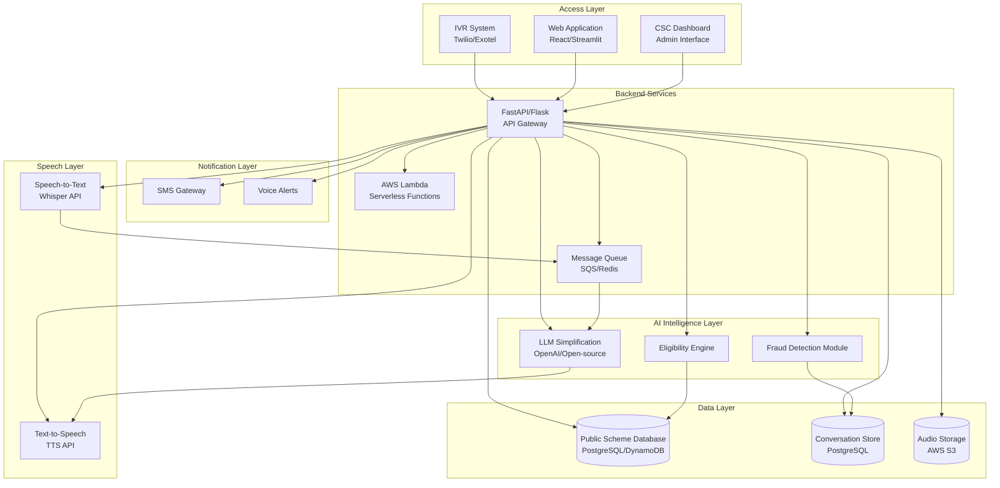
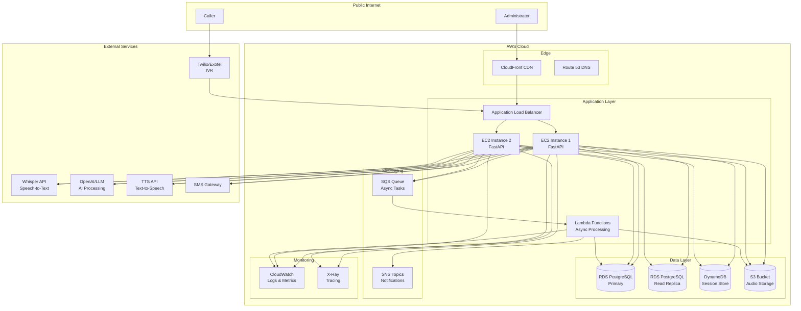

# Design Document: AI-Powered IVR System

## Overview

The AI-Powered IVR System is built on a five-layer architecture that separates concerns and enables scalability. The system processes incoming calls through speech recognition, applies AI intelligence for understanding and fraud detection, queries scheme databases, and delivers responses via text-to-speech and SMS notifications. The architecture supports both IVR phone interactions and web-based dashboard access.

### Key Design Principles

1. **Layered Architecture**: Clear separation between access, speech processing, AI intelligence, data, and notifications
2. **Microservices**: Each component is independently deployable and scalable
3. **Event-Driven**: Asynchronous processing using message queues for non-blocking operations
4. **Cloud-Native**: Leverages AWS services for scalability, reliability, and cost optimization
5. **Security-First**: Encryption at rest and in transit, authentication, and compliance with data regulations

## Architecture

### High-Level Architecture Diagram



### Layer Responsibilities

**1. Access Layer**
- IVR System: Handles incoming phone calls via Twilio/Exotel
- Web Application: Provides browser-based access for users
- CSC Dashboard: Administrative interface for monitoring and configuration

**2. Speech Layer**
- Speech-to-Text: Converts caller audio to text using Whisper
- Text-to-Speech: Converts AI responses to natural-sounding audio

**3. AI Intelligence Layer**
- Eligibility Engine: Determines caller eligibility for schemes/services
- LLM Simplification: Processes queries and generates human-like responses
- Fraud Detection Module: Identifies suspicious patterns and potential fraud

**4. Data Layer**
- Public Scheme Database: Stores information about government schemes, services, and eligibility criteria
- Conversation Store: Maintains call transcripts, metadata, and analytics
- Audio Storage: S3-based storage for call recordings

**5. Notification Layer**
- SMS Gateway: Sends text message confirmations and alerts
- Voice Alerts: Delivers automated voice notifications

## Components and Interfaces

### 1. IVR Call Handler

**Responsibility**: Manages incoming calls, call flow, and integration with Twilio/Exotel.

**Technology**: Python with Twilio/Exotel SDK

**Key Methods**:
```python
class IVRCallHandler:
    def handle_incoming_call(call_sid: str, from_number: str) -> CallSession
    def play_greeting(call_sid: str, language: str) -> None
    def start_recording(call_sid: str) -> str
    def transfer_to_agent(call_sid: str, agent_id: str) -> bool
    def end_call(call_sid: str) -> None
    def handle_dtmf_input(call_sid: str, digits: str) -> None
```

**Interfaces**:
- Input: Webhook from Twilio/Exotel with call parameters
- Output: TwiML/Exotel XML responses for call control
- Events: Publishes call events to message queue

### 2. Speech Recognition Service

**Responsibility**: Converts audio streams to text using Whisper API.

**Technology**: Python with OpenAI Whisper API or local Whisper model

**Key Methods**:
```python
class SpeechRecognizer:
    def transcribe_audio(audio_data: bytes, language: str) -> TranscriptionResult
    def detect_language(audio_data: bytes) -> str
    def stream_transcribe(audio_stream: Iterator[bytes]) -> Iterator[str]
    def filter_noise(audio_data: bytes) -> bytes
```

**Interfaces**:
- Input: Audio data (WAV/MP3), language code
- Output: Transcribed text, confidence score, detected language
- Integration: Whisper API via HTTP or local model inference

### 3. LLM Processor

**Responsibility**: Understands caller intent, maintains conversation context, generates responses.

**Technology**: Python with OpenAI API or open-source LLM (Llama, Mistral)

**Key Methods**:
```python
class LLMProcessor:
    def process_query(text: str, context: ConversationContext) -> LLMResponse
    def extract_intent(text: str) -> Intent
    def extract_entities(text: str) -> List[Entity]
    def generate_response(intent: Intent, entities: List[Entity], context: ConversationContext) -> str
    def detect_sentiment(text: str) -> Sentiment
    def should_escalate(context: ConversationContext) -> bool
```

**Interfaces**:
- Input: Transcribed text, conversation context
- Output: Response text, intent, entities, sentiment score
- Integration: OpenAI API or local LLM via HTTP/gRPC

### 4. Eligibility Engine

**Responsibility**: Determines caller eligibility for schemes based on criteria and user data.

**Technology**: Python with business rules engine

**Key Methods**:
```python
class EligibilityEngine:
    def check_eligibility(user_data: UserProfile, scheme_id: str) -> EligibilityResult
    def get_applicable_schemes(user_data: UserProfile) -> List[Scheme]
    def calculate_benefit_amount(user_data: UserProfile, scheme_id: str) -> Decimal
    def validate_documents(documents: List[Document], scheme_id: str) -> ValidationResult
```

**Interfaces**:
- Input: User profile data, scheme ID
- Output: Eligibility status, applicable schemes, benefit amounts
- Data Source: Public Scheme Database

### 5. Fraud Detection Module

**Responsibility**: Identifies suspicious patterns, duplicate claims, and potential fraud.

**Technology**: Python with ML models (scikit-learn, TensorFlow)

**Key Methods**:
```python
class FraudDetector:
    def analyze_call_pattern(caller_id: str, call_history: List[CallSession]) -> FraudScore
    def detect_duplicate_claim(user_data: UserProfile, scheme_id: str) -> bool
    def verify_caller_identity(voice_sample: bytes, caller_id: str) -> VerificationResult
    def flag_suspicious_activity(call_session: CallSession) -> List[FraudIndicator]
```

**Interfaces**:
- Input: Call session data, user profile, voice biometrics
- Output: Fraud score, risk indicators, verification status
- Data Source: Conversation Store, historical patterns

### 6. Text-to-Speech Engine

**Responsibility**: Converts text responses to natural-sounding speech.

**Technology**: Python with TTS API (Google Cloud TTS, Amazon Polly, or ElevenLabs)

**Key Methods**:
```python
class TTSEngine:
    def synthesize_speech(text: str, language: str, voice_id: str) -> bytes
    def get_available_voices(language: str) -> List[Voice]
    def adjust_speech_rate(audio: bytes, rate: float) -> bytes
    def add_ssml_markup(text: str, pauses: List[int]) -> str
```

**Interfaces**:
- Input: Text, language, voice preferences
- Output: Audio data (MP3/WAV)
- Integration: TTS API via HTTP

### 7. SMS Gateway Service

**Responsibility**: Sends SMS notifications and confirmations.

**Technology**: Python with SMS provider SDK (Twilio, AWS SNS, or third-party)

**Key Methods**:
```python
class SMSGateway:
    def send_sms(phone_number: str, message: str) -> DeliveryStatus
    def send_bulk_sms(recipients: List[str], message: str) -> List[DeliveryStatus]
    def get_delivery_status(message_id: str) -> DeliveryStatus
    def format_message_template(template: str, variables: Dict) -> str
```

**Interfaces**:
- Input: Phone number, message content
- Output: Delivery status, message ID
- Integration: SMS provider API via HTTP

### 8. Conversation Store

**Responsibility**: Persists call data, transcripts, and metadata for analytics.

**Technology**: PostgreSQL or DynamoDB with SQLAlchemy/Boto3

**Schema**:
```python
class CallSession:
    session_id: UUID
    caller_phone: str
    start_time: datetime
    end_time: datetime
    duration_seconds: int
    language: str
    resolution_status: str
    sentiment_score: float
    fraud_score: float
    
class Transcript:
    transcript_id: UUID
    session_id: UUID
    timestamp: datetime
    speaker: str  # 'caller' or 'system'
    text: str
    confidence: float
    
class AudioRecording:
    recording_id: UUID
    session_id: UUID
    s3_bucket: str
    s3_key: str
    duration_seconds: int
    file_size_bytes: int
```

**Key Methods**:
```python
class ConversationStore:
    def create_session(caller_phone: str, language: str) -> CallSession
    def save_transcript(session_id: UUID, speaker: str, text: str) -> None
    def save_audio_reference(session_id: UUID, s3_uri: str) -> None
    def get_session(session_id: UUID) -> CallSession
    def search_sessions(filters: Dict, date_range: Tuple) -> List[CallSession]
    def get_analytics(date_range: Tuple) -> AnalyticsReport
```

### 9. Public Scheme Database

**Responsibility**: Stores government schemes, eligibility criteria, and benefit information.

**Technology**: PostgreSQL with full-text search

**Schema**:
```python
class Scheme:
    scheme_id: UUID
    name: str
    description: str
    category: str
    eligibility_criteria: JSON
    benefit_amount: Decimal
    application_process: str
    required_documents: List[str]
    active: bool
    
class EligibilityCriteria:
    criteria_id: UUID
    scheme_id: UUID
    field_name: str  # 'age', 'income', 'location', etc.
    operator: str  # '>', '<', '==', 'in', etc.
    value: JSON
```

**Key Methods**:
```python
class SchemeDatabase:
    def get_scheme(scheme_id: UUID) -> Scheme
    def search_schemes(query: str, filters: Dict) -> List[Scheme]
    def get_eligibility_criteria(scheme_id: UUID) -> List[EligibilityCriteria]
    def update_scheme(scheme_id: UUID, updates: Dict) -> None
```

### 10. Dashboard Service

**Responsibility**: Provides web interface for monitoring and administration.

**Technology**: React or Streamlit with FastAPI backend

**Key Features**:
- Real-time call monitoring dashboard
- Historical analytics and reporting
- Scheme management interface
- User and access control
- System configuration

**API Endpoints**:
```python
# Dashboard API
GET /api/dashboard/stats/realtime -> RealtimeStats
GET /api/dashboard/calls/active -> List[ActiveCall]
GET /api/dashboard/analytics -> AnalyticsData
GET /api/sessions/{session_id} -> CallSessionDetail
GET /api/sessions/search -> List[CallSession]
POST /api/schemes -> Scheme
PUT /api/schemes/{scheme_id} -> Scheme
GET /api/config -> SystemConfig
PUT /api/config -> SystemConfig
```

### 11. API Gateway

**Responsibility**: Central entry point for all API requests, handles authentication and routing.

**Technology**: FastAPI with JWT authentication

**Key Endpoints**:
```python
# Call Management
POST /api/calls/incoming -> CallSession
POST /api/calls/{call_sid}/transcribe -> TranscriptionResult
POST /api/calls/{call_sid}/respond -> TTSResponse
POST /api/calls/{call_sid}/transfer -> TransferResult
POST /api/calls/{call_sid}/end -> None

# AI Processing
POST /api/ai/process -> LLMResponse
POST /api/ai/eligibility -> EligibilityResult
POST /api/ai/fraud-check -> FraudScore

# Notifications
POST /api/notifications/sms -> DeliveryStatus
POST /api/notifications/voice -> DeliveryStatus

# Data Access
GET /api/schemes -> List[Scheme]
GET /api/schemes/{scheme_id} -> Scheme
POST /api/sessions/search -> List[CallSession]
GET /api/sessions/{session_id} -> CallSessionDetail
```

## Data Models

### Core Data Structures

```python
from dataclasses import dataclass
from datetime import datetime
from decimal import Decimal
from enum import Enum
from typing import List, Dict, Optional
from uuid import UUID

class Language(Enum):
    ENGLISH = "en"
    SPANISH = "es"
    FRENCH = "fr"
    GERMAN = "de"
    HINDI = "hi"

class CallStatus(Enum):
    INITIATED = "initiated"
    IN_PROGRESS = "in_progress"
    COMPLETED = "completed"
    TRANSFERRED = "transferred"
    FAILED = "failed"

class ResolutionStatus(Enum):
    RESOLVED = "resolved"
    ESCALATED = "escalated"
    ABANDONED = "abandoned"
    PENDING = "pending"

@dataclass
class CallSession:
    session_id: UUID
    caller_phone: str
    start_time: datetime
    end_time: Optional[datetime]
    duration_seconds: int
    language: Language
    status: CallStatus
    resolution_status: ResolutionStatus
    sentiment_score: float
    fraud_score: float
    recording_url: Optional[str]

@dataclass
class TranscriptionResult:
    text: str
    confidence: float
    language: Language
    duration_seconds: float
    timestamp: datetime

@dataclass
class Intent:
    name: str
    confidence: float
    category: str

@dataclass
class Entity:
    type: str
    value: str
    confidence: float

@dataclass
class ConversationContext:
    session_id: UUID
    messages: List[Dict[str, str]]
    user_data: Dict
    current_intent: Optional[Intent]
    extracted_entities: List[Entity]

@dataclass
class LLMResponse:
    text: str
    intent: Intent
    entities: List[Entity]
    sentiment: float
    should_escalate: bool
    confidence: float

@dataclass
class UserProfile:
    user_id: Optional[UUID]
    phone_number: str
    age: Optional[int]
    income: Optional[Decimal]
    location: Optional[str]
    documents: List[str]
    verified: bool

@dataclass
class Scheme:
    scheme_id: UUID
    name: str
    description: str
    category: str
    eligibility_criteria: Dict
    benefit_amount: Decimal
    application_process: str
    required_documents: List[str]
    active: bool

@dataclass
class EligibilityResult:
    eligible: bool
    scheme: Scheme
    reasons: List[str]
    missing_requirements: List[str]
    estimated_benefit: Optional[Decimal]

@dataclass
class FraudScore:
    score: float  # 0.0 to 1.0
    risk_level: str  # 'low', 'medium', 'high'
    indicators: List[str]
    recommended_action: str

@dataclass
class DeliveryStatus:
    message_id: str
    status: str  # 'sent', 'delivered', 'failed'
    timestamp: datetime
    error_message: Optional[str]
```

## Correctness Properties

*A property is a characteristic or behavior that should hold true across all valid executions of a system—essentially, a formal statement about what the system should do. Properties serve as the bridge between human-readable specifications and machine-verifiable correctness guarantees.*


### Property Reflection

After analyzing all acceptance criteria, I've identified the following testable properties. Here's the reflection to eliminate redundancy:

**Redundancy Analysis:**
- Properties 6.2 (audio encryption) and 9.2 (data encryption) both test encryption - can be combined into one comprehensive encryption property
- Properties 3.6 (authentication for sensitive info) and 9.1 (authentication requirement) are the same - consolidate
- Properties 5.3 (SMS confirmation) and 5.2 (SMS content) can be combined - both test SMS behavior
- Properties 10.2, 10.3, 10.4 all test language consistency - can be combined into one comprehensive language handling property
- Properties 7.5 and 7.6 both test dashboard data display - keep separate as they test different aspects

**Properties to Keep:**
- State transitions (1.3, 2.5)
- Error handling (1.5, 2.6, 3.5, 5.4, 8.3, 13.1, 13.2, 13.3, 13.4)
- Data integrity (6.1, 6.3, 6.4)
- Security (9.2 combined, 9.3, 9.5, 3.6 combined)
- Language handling (10.1, 10.5, combined 10.2-10.4)
- Context preservation (3.3, 8.2)
- User interaction (4.3, 4.4, 4.5)
- Notifications (5.2 combined, 5.5, 8.4)
- Configuration (12.1, 12.2, 12.3)
- Recording compliance (14.1, 14.2, 14.3, 14.4)
- Analytics (11.2, 11.3, 11.4, 11.5)

### Correctness Properties

Property 1: State Transition After Greeting
*For any* call session, after the greeting message completes, the system should transition to the listening state and activate the Speech_Recognizer.
**Validates: Requirements 1.3**

Property 2: Capacity Overflow Handling
*For any* incoming call when system capacity is at maximum, the system should queue the call and play a busy message to the caller.
**Validates: Requirements 1.5**

Property 3: Speech Transcription
*For any* audio input containing speech, the Speech_Recognizer should produce a non-empty transcription result.
**Validates: Requirements 2.1**

Property 4: Multi-Language Support
*For any* of the supported languages (English, Spanish, French, German, Hindi), the Speech_Recognizer should successfully transcribe speech in that language.
**Validates: Requirements 2.3, 10.5**

Property 5: Silence Detection and Finalization
*For any* transcription session, when silence is detected for 3 consecutive seconds, the transcription should be finalized and passed to the LLM_Processor.
**Validates: Requirements 2.5**

Property 6: Low Confidence Retry
*For any* transcription with confidence score below the threshold, the system should request the caller to repeat their statement.
**Validates: Requirements 2.6**

Property 7: Conversation Context Preservation
*For any* conversation with multiple turns, references to entities mentioned in previous turns should be correctly resolved in subsequent responses.
**Validates: Requirements 3.3**

Property 8: Out-of-Domain Query Handling
*For any* query that falls outside the system's knowledge base, the LLM_Processor should offer to transfer to a human agent or provide alternative assistance options.
**Validates: Requirements 3.5**

Property 9: Authentication for Sensitive Data
*For any* request to access sensitive information (personal data, account details, payment info), the system should require caller authentication before providing the information.
**Validates: Requirements 3.6, 9.1**

Property 10: Voice Consistency
*For any* call session, all TTS-generated audio should use the same voice ID and characteristics throughout the conversation.
**Validates: Requirements 4.3**

Property 11: Interrupt Handling
*For any* audio playback in progress, when the caller speaks, the system should stop playback and begin listening for input.
**Validates: Requirements 4.4**

Property 12: Sentence Pause Insertion
*For any* text response containing multiple sentences, the TTS audio should include pauses at sentence boundaries.
**Validates: Requirements 4.5**

Property 13: SMS Content Completeness
*For any* SMS notification sent, the message should include all relevant call details (reference number, appointment time, or confirmation code as applicable) and delivery should be confirmed verbally to the caller.
**Validates: Requirements 5.2, 5.3**

Property 14: SMS Delivery Failure Handling
*For any* SMS that fails to deliver, the system should notify the caller of the failure and offer alternative delivery methods (email, voice message, or retry).
**Validates: Requirements 5.4**

Property 15: Opt-in Summary SMS
*For any* call session where the caller opted in for SMS summary, a summary message should be sent when the call concludes.
**Validates: Requirements 5.5**

Property 16: Unique Session Creation
*For any* new call, the Conversation_Store should create a record with a unique session ID that doesn't conflict with any existing session.
**Validates: Requirements 6.1**

Property 17: Encrypted Storage
*For any* data stored by the system (audio recordings, transcripts, user data), it should be encrypted at rest using AES-256 encryption.
**Validates: Requirements 6.2, 9.2**

Property 18: Transcript Storage with Timestamps
*For any* completed transcription, the Conversation_Store should save the full text with timestamps for each utterance.
**Validates: Requirements 6.3**

Property 19: Complete Metadata Storage
*For any* ended call, the Conversation_Store should save all required metadata fields: duration, caller ID, resolution status, and sentiment score.
**Validates: Requirements 6.4**

Property 20: Dashboard Search Filtering
*For any* conversation search query with filters (date range, caller ID, keywords, resolution status), the results should only include sessions matching all specified filter criteria.
**Validates: Requirements 7.5**

Property 21: Session Detail Completeness
*For any* call session selected in the dashboard, the detail view should display the full transcript, audio playback controls, and all metadata fields.
**Validates: Requirements 7.6**

Property 22: Agent Context Transfer
*For any* call transferred to a human agent, the agent interface should receive the complete call context including transcript and caller information.
**Validates: Requirements 8.2**

Property 23: No Agent Available Fallback
*For any* transfer request when no agents are available, the system should offer callback scheduling or voicemail options.
**Validates: Requirements 8.3**

Property 24: Callback Confirmation SMS
*For any* scheduled callback, an SMS confirmation containing the expected callback time should be sent to the caller.
**Validates: Requirements 8.4**

Property 25: Sentiment-Based Escalation
*For any* conversation where sentiment analysis detects caller frustration (sentiment score below threshold), the system should proactively offer transfer to a human agent.
**Validates: Requirements 8.5**

Property 26: TLS Encryption for Transmission
*For any* network communication between system components, TLS 1.3 should be used for data transmission.
**Validates: Requirements 9.3**

Property 27: Account Lockout After Failed Authentication
*For any* caller account with three consecutive failed authentication attempts, the account should be locked and an alert sent to administrators.
**Validates: Requirements 9.5**

Property 28: Language Detection and Selection
*For any* incoming call, the system should either automatically detect the caller's language from initial speech or provide a menu for manual language selection.
**Validates: Requirements 10.1**

Property 29: Language Consistency Across Components
*For any* call conducted in a specific language, the Speech_Recognizer should use the appropriate language model, the LLM_Processor should respond in the same language, and the TTS_Engine should use a native speaker voice for that language.
**Validates: Requirements 10.2, 10.3, 10.4**

Property 30: Intent and FAQ Analysis
*For any* set of conversation transcripts, the analytics system should identify and rank common caller intents and frequently asked questions.
**Validates: Requirements 11.2**

Property 31: Satisfaction Score Calculation
*For any* set of completed calls with post-call surveys, the system should calculate the average customer satisfaction score.
**Validates: Requirements 11.3**

Property 32: Report Export Formats
*For any* generated report, both CSV and PDF export formats should be available for download.
**Validates: Requirements 11.4**

Property 33: Scheduled Report Generation
*For any* configured report schedule (daily, weekly, monthly), the system should automatically generate and email the report at the specified interval.
**Validates: Requirements 11.5**

Property 34: Greeting Configuration Options
*For any* greeting configuration, administrators should be able to either upload a custom audio file or provide text for TTS conversion, and both methods should result in a functional greeting.
**Validates: Requirements 12.1**

Property 35: Knowledge Base CRUD Operations
*For any* FAQ entry in the knowledge base, administrators should be able to create, read, update, and delete the entry through the dashboard.
**Validates: Requirements 12.2**

Property 36: Business Rule Configuration
*For any* business rule type (call routing logic, escalation triggers, operating hours), administrators should be able to configure the rules through the dashboard.
**Validates: Requirements 12.3**

Property 37: Speech Recognition Failover
*For any* call where the Speech_Recognizer fails or becomes unavailable, the system should automatically switch to DTMF input mode and notify the caller of the change.
**Validates: Requirements 13.1**

Property 38: LLM Processor Fallback
*For any* query when the LLM_Processor is unavailable, the system should use fallback scripted responses for common queries.
**Validates: Requirements 13.2**

Property 39: TTS Engine Fallback
*For any* response when the TTS_Engine fails, the system should play pre-recorded audio messages instead.
**Validates: Requirements 13.3**

Property 40: Critical Failure Alerting
*For any* critical component failure, the system should log the error with full context and send alerts to administrators via both email and SMS.
**Validates: Requirements 13.4**

Property 41: Recording Disclosure
*For any* incoming call, the system should play a recording disclosure message before beginning to record the conversation.
**Validates: Requirements 14.1**

Property 42: Dual Channel Recording
*For any* call recording, both the caller's audio and the system's audio should be captured in separate channels in high quality format.
**Validates: Requirements 14.2**

Property 43: Retention Policy Tagging
*For any* stored recording, the Conversation_Store should tag it with the appropriate jurisdiction-specific retention policy based on the caller's location.
**Validates: Requirements 14.3**

Property 44: Recording Opt-Out Handling
*For any* call where the caller opts out of recording, the system should immediately stop recording and update the Call_Session metadata to reflect the opt-out status.
**Validates: Requirements 14.4**

## Error Handling

### Error Categories

**1. External Service Failures**
- Speech recognition API unavailable
- LLM API rate limits or timeouts
- TTS service failures
- SMS gateway errors
- Database connection issues

**Strategy**: Implement circuit breakers, fallback mechanisms, and graceful degradation.

**2. Invalid Input Errors**
- Unintelligible audio
- Out-of-domain queries
- Invalid phone numbers
- Malformed data

**Strategy**: Validate inputs, provide clear error messages, offer alternatives.

**3. Authentication and Authorization Errors**
- Failed authentication attempts
- Insufficient permissions
- Expired sessions

**Strategy**: Implement retry limits, account lockout, clear feedback to users.

**4. Resource Exhaustion**
- Maximum concurrent calls reached
- Database connection pool exhausted
- API rate limits exceeded

**Strategy**: Implement queuing, auto-scaling, rate limiting, and backpressure.

### Error Handling Patterns

```python
class ErrorHandler:
    def handle_speech_recognition_error(self, error: Exception, call_session: CallSession) -> None:
        """Fallback to DTMF input when speech recognition fails"""
        log_error(error, call_session.session_id)
        switch_to_dtmf_mode(call_session)
        play_message(call_session, "We're having trouble hearing you. Please use your keypad.")
    
    def handle_llm_timeout(self, query: str, context: ConversationContext) -> str:
        """Use scripted responses when LLM is unavailable"""
        log_warning("LLM timeout", context.session_id)
        return get_scripted_response(query) or "I'm having trouble processing your request. Would you like to speak with an agent?"
    
    def handle_tts_failure(self, text: str, call_session: CallSession) -> None:
        """Play pre-recorded audio when TTS fails"""
        log_error("TTS failure", call_session.session_id)
        play_prerecorded_audio(call_session, get_closest_prerecorded_message(text))
    
    def handle_sms_delivery_failure(self, phone: str, message: str, call_session: CallSession) -> None:
        """Offer alternatives when SMS fails"""
        log_error(f"SMS delivery failed to {phone}", call_session.session_id)
        play_message(call_session, "We couldn't send the SMS. Would you like us to email you instead?")
        offer_alternatives(call_session, ["email", "voice_message", "retry"])
    
    def handle_capacity_exceeded(self, call_sid: str) -> None:
        """Queue calls when capacity is reached"""
        log_warning(f"Capacity exceeded for call {call_sid}")
        play_message(call_sid, "All our lines are busy. Please hold, and we'll be with you shortly.")
        enqueue_call(call_sid)
    
    def handle_authentication_failure(self, caller_id: str, attempt_count: int) -> None:
        """Lock account after multiple failed attempts"""
        if attempt_count >= 3:
            lock_account(caller_id)
            notify_administrators(f"Account {caller_id} locked after {attempt_count} failed attempts")
            play_message(caller_id, "Your account has been locked for security. Please contact support.")
        else:
            play_message(caller_id, f"Authentication failed. You have {3 - attempt_count} attempts remaining.")
```

### Retry Strategies

```python
from tenacity import retry, stop_after_attempt, wait_exponential

class RetryableOperations:
    @retry(stop=stop_after_attempt(3), wait=wait_exponential(multiplier=1, min=2, max=10))
    def call_llm_api(self, prompt: str) -> str:
        """Retry LLM API calls with exponential backoff"""
        return llm_client.complete(prompt)
    
    @retry(stop=stop_after_attempt(3), wait=wait_exponential(multiplier=1, min=1, max=5))
    def send_sms(self, phone: str, message: str) -> DeliveryStatus:
        """Retry SMS sending with exponential backoff"""
        return sms_gateway.send(phone, message)
    
    @retry(stop=stop_after_attempt(5), wait=wait_exponential(multiplier=1, min=1, max=30))
    def save_to_database(self, data: Dict) -> None:
        """Retry database operations with exponential backoff"""
        conversation_store.save(data)
```

## Testing Strategy

### Dual Testing Approach

The system will employ both unit testing and property-based testing to ensure comprehensive coverage:

**Unit Tests**: Focus on specific examples, edge cases, and integration points
- Test specific call flows with known inputs and expected outputs
- Test error conditions and boundary cases
- Test integration between components
- Validate specific business rules and configurations

**Property-Based Tests**: Verify universal properties across all inputs
- Test properties that should hold for any valid input
- Generate random test data to discover edge cases
- Verify invariants and system-wide guarantees
- Each property test runs minimum 100 iterations

Both approaches are complementary and necessary for comprehensive coverage. Unit tests catch concrete bugs in specific scenarios, while property tests verify general correctness across the input space.

### Property-Based Testing Configuration

**Framework**: Use Hypothesis (Python) for property-based testing

**Configuration**:
- Minimum 100 iterations per property test
- Each test tagged with feature name and property number
- Tag format: `# Feature: ai-powered-ivr, Property {N}: {property_text}`

**Example Property Test**:
```python
from hypothesis import given, strategies as st
import pytest

# Feature: ai-powered-ivr, Property 16: Unique Session Creation
@given(st.lists(st.text(min_size=10), min_size=10, max_size=100))
@pytest.mark.property_test
def test_unique_session_ids(caller_phones):
    """For any new call, the Conversation_Store should create a record with a unique session ID"""
    session_ids = set()
    
    for phone in caller_phones:
        session = conversation_store.create_session(phone, "en")
        assert session.session_id not in session_ids, "Session ID must be unique"
        session_ids.add(session.session_id)

# Feature: ai-powered-ivr, Property 29: Language Consistency Across Components
@given(
    st.sampled_from(["en", "es", "fr", "de", "hi"]),
    st.text(min_size=10, max_size=200)
)
@pytest.mark.property_test
def test_language_consistency(language, text):
    """For any call in a specific language, all components should use that language"""
    # Create call session with specified language
    session = create_call_session(language=language)
    
    # Verify Speech Recognizer uses correct language model
    stt_config = speech_recognizer.get_config(session)
    assert stt_config.language == language
    
    # Verify LLM responds in same language
    response = llm_processor.process_query(text, session.context)
    assert detect_language(response.text) == language
    
    # Verify TTS uses native voice for language
    tts_config = tts_engine.get_voice_config(language)
    assert tts_config.language == language
    assert tts_config.is_native_speaker

# Feature: ai-powered-ivr, Property 17: Encrypted Storage
@given(
    st.binary(min_size=100, max_size=10000),
    st.text(min_size=50, max_size=500)
)
@pytest.mark.property_test
def test_encrypted_storage(audio_data, transcript_text):
    """For any data stored, it should be encrypted at rest using AES-256"""
    session = create_call_session()
    
    # Store audio
    audio_ref = conversation_store.save_audio_reference(session.session_id, audio_data)
    stored_audio = s3_client.get_object(audio_ref.s3_bucket, audio_ref.s3_key)
    assert is_encrypted_aes256(stored_audio), "Audio must be encrypted with AES-256"
    
    # Store transcript
    conversation_store.save_transcript(session.session_id, "caller", transcript_text)
    stored_transcript = database.query(f"SELECT text FROM transcripts WHERE session_id = '{session.session_id}'")
    assert is_encrypted_aes256(stored_transcript), "Transcript must be encrypted with AES-256"
```

### Unit Testing Strategy

**Framework**: pytest with fixtures for test data

**Coverage Areas**:
1. **Component Integration Tests**
   - Test IVR webhook handling
   - Test API endpoint responses
   - Test database operations
   - Test external service integrations

2. **Business Logic Tests**
   - Test eligibility calculation with specific user profiles
   - Test fraud detection with known patterns
   - Test intent extraction with sample queries
   - Test call routing logic

3. **Edge Case Tests**
   - Empty or null inputs
   - Maximum length inputs
   - Special characters and encoding
   - Concurrent operations

4. **Error Condition Tests**
   - Service unavailability
   - Network timeouts
   - Invalid authentication
   - Resource exhaustion

**Example Unit Tests**:
```python
import pytest
from unittest.mock import Mock, patch

def test_call_handler_answers_within_time_limit():
    """Test that calls are answered promptly"""
    handler = IVRCallHandler()
    start_time = time.time()
    session = handler.handle_incoming_call("CA123", "+1234567890")
    elapsed = time.time() - start_time
    
    assert session is not None
    assert elapsed < 5.0  # Should answer within 5 seconds

def test_eligibility_engine_with_qualified_user():
    """Test eligibility check with a user who meets all criteria"""
    engine = EligibilityEngine()
    user = UserProfile(
        phone_number="+1234567890",
        age=65,
        income=Decimal("15000"),
        location="CA"
    )
    scheme = get_test_scheme("senior-assistance")
    
    result = engine.check_eligibility(user, scheme.scheme_id)
    
    assert result.eligible is True
    assert len(result.missing_requirements) == 0
    assert result.estimated_benefit > 0

def test_fraud_detector_flags_duplicate_claims():
    """Test that duplicate claims are detected"""
    detector = FraudDetector()
    user = create_test_user()
    scheme_id = "test-scheme-123"
    
    # First claim should be fine
    assert detector.detect_duplicate_claim(user, scheme_id) is False
    
    # Record the claim
    record_claim(user, scheme_id)
    
    # Second claim should be flagged
    assert detector.detect_duplicate_claim(user, scheme_id) is True

@patch('external_services.whisper_api')
def test_speech_recognizer_handles_api_failure(mock_whisper):
    """Test fallback when Whisper API fails"""
    mock_whisper.transcribe.side_effect = Exception("API Error")
    recognizer = SpeechRecognizer()
    
    with pytest.raises(SpeechRecognitionError):
        recognizer.transcribe_audio(b"audio_data", "en")

def test_sms_gateway_formats_message_correctly():
    """Test SMS message formatting with template variables"""
    gateway = SMSGateway()
    template = "Your appointment is scheduled for {time} on {date}. Reference: {ref}"
    variables = {
        "time": "2:00 PM",
        "date": "March 15, 2024",
        "ref": "APT-12345"
    }
    
    message = gateway.format_message_template(template, variables)
    
    assert "2:00 PM" in message
    assert "March 15, 2024" in message
    assert "APT-12345" in message
    assert "{" not in message  # No unresolved placeholders
```

### Integration Testing

**Approach**: Test end-to-end call flows with all components

**Test Scenarios**:
1. Complete successful call flow
2. Call with transfer to agent
3. Call with SMS confirmation
4. Multi-language call handling
5. Call with authentication
6. Call with fraud detection trigger
7. Call with service failures and fallbacks

### Performance Testing

**Tools**: Locust or Apache JMeter for load testing

**Metrics to Measure**:
- Concurrent call capacity
- API response times
- Database query performance
- Speech recognition latency
- LLM processing time
- TTS generation time

**Load Test Scenarios**:
- Ramp up to 50 concurrent calls
- Sustained load at 40 concurrent calls for 1 hour
- Spike test: sudden increase from 10 to 50 calls
- Stress test: gradually increase beyond capacity to find breaking point

### Security Testing

**Areas to Test**:
- Authentication bypass attempts
- SQL injection in search queries
- XSS in dashboard inputs
- Encryption verification
- TLS configuration
- Access control enforcement
- PII data handling

**Tools**: OWASP ZAP, Burp Suite for security scanning

## Deployment Architecture

### AWS Infrastructure



### Deployment Strategy

**Blue-Green Deployment**:
- Maintain two identical production environments
- Deploy to inactive environment
- Run smoke tests
- Switch traffic via load balancer
- Keep old environment for quick rollback

**Auto-Scaling Configuration**:
- Scale EC2 instances based on CPU and active call count
- Minimum 2 instances, maximum 10 instances
- Scale up when CPU > 70% or active calls > 40
- Scale down when CPU < 30% and active calls < 20

### Monitoring and Observability

**Metrics to Track**:
- Call volume and duration
- API response times (p50, p95, p99)
- Error rates by component
- Speech recognition accuracy
- LLM response quality
- Customer satisfaction scores
- System resource utilization

**Alerting Rules**:
- Error rate > 5% for 5 minutes
- API response time p95 > 5 seconds
- Active calls approaching capacity (> 45)
- Database connection pool > 80% utilized
- Any critical component failure

**Logging Strategy**:
- Structured JSON logs
- Correlation IDs for request tracing
- Log levels: DEBUG, INFO, WARNING, ERROR, CRITICAL
- Centralized logging in CloudWatch
- Log retention: 90 days

## Security Considerations

### Data Protection

1. **Encryption at Rest**: All data encrypted with AES-256
2. **Encryption in Transit**: TLS 1.3 for all communications
3. **Key Management**: AWS KMS for encryption key management
4. **Data Masking**: PII masked in logs and non-production environments

### Access Control

1. **Authentication**: JWT tokens for API access, MFA for admin dashboard
2. **Authorization**: Role-based access control (RBAC)
3. **API Security**: Rate limiting, API key rotation, IP whitelisting
4. **Audit Logging**: All access and modifications logged

### Compliance

1. **GDPR**: Right to access, right to deletion, data portability
2. **CCPA**: Consumer data rights, opt-out mechanisms
3. **PCI-DSS**: If handling payment data, full compliance required
4. **HIPAA**: If handling health data, BAA with all vendors

### Voice Biometrics Security

1. **Voiceprint Storage**: Encrypted and isolated
2. **Liveness Detection**: Prevent replay attacks
3. **Threshold Tuning**: Balance security and user experience
4. **Fallback Authentication**: PIN or knowledge-based questions

## Scalability Considerations

### Horizontal Scaling

- **API Servers**: Stateless design allows unlimited horizontal scaling
- **Database**: Read replicas for query distribution
- **Message Queues**: Distribute load across multiple consumers
- **Caching**: Redis for session data and frequently accessed content

### Vertical Scaling

- **Database**: Upgrade RDS instance size as data grows
- **EC2 Instances**: Use larger instance types for compute-intensive tasks

### Cost Optimization

- **Lambda for Async Tasks**: Pay only for execution time
- **S3 Lifecycle Policies**: Move old recordings to Glacier
- **Reserved Instances**: For baseline capacity
- **Spot Instances**: For non-critical batch processing

## Future Enhancements

1. **Video Call Support**: Add video capabilities for visual assistance
2. **Chatbot Integration**: Web and mobile chat interfaces
3. **Predictive Analytics**: ML models for call volume forecasting
4. **Sentiment Analysis**: Real-time emotion detection
5. **Multi-Channel Support**: Email, social media integration
6. **Advanced Fraud Detection**: Deep learning models for pattern recognition
7. **Voice Cloning Detection**: Identify synthetic voices
8. **Multilingual Expansion**: Support for 20+ languages
9. **Offline Mode**: Local processing for network outages
10. **Blockchain Integration**: Immutable audit trail for compliance
